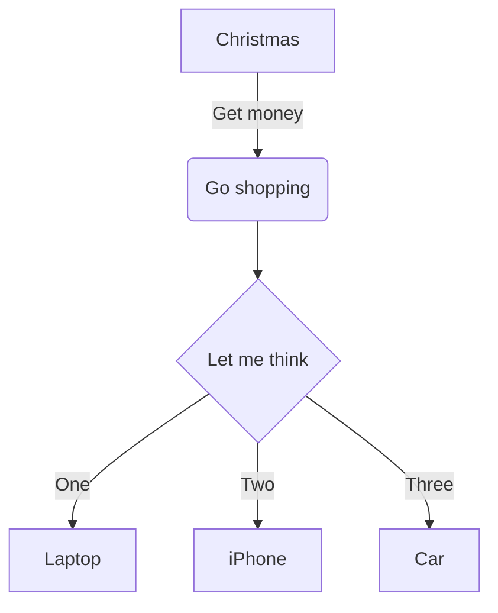

# Title

## Table of Contents

1. [Introduction](#introduction)
2. [Multi Word Section](#multi-word-section)
   1. [Subsection](#subsection)
3. [Code Block](#code)
   1. [Inline](#inline)
   2. [Block](#block)
5. [Link to subfolder](#link-to-subfolder)
6. [Footnotes](#footnotes)
7. [Mermaid](#mermaid)
8. [Spoiler](#spoiler)
9. [References](#references)

## Introduction

Introduction paragraph.

## Multi Word Section

Multi word section paragraph.

### Subsection

Subsection paragraph.

## Code

### Inline

An example of `inline code`. 

### Block

An example code block:

```html
<div>
  <p>Hello World</p>
```

## Link to subfolder

You can find more information in the [example](docs/example.md) page.

## Footnotes

Here is a simple footnote[^1].

A footnote can also have multiple lines[^2].  

You can also use words, to fit your writing style more closely[^note].

[^1]: My reference.
[^2]: Every new line should be prefixed with 2 spaces.  
  This allows you to have a footnote with multiple lines.
[^note]:
    Named footnotes will still render with numbers instead of the text but allow easier identification and linking.  
    This footnote also has been made with a different syntax using 4 spaces for new lines.

## Mermaid

* [Mermaid Live Editor](https://mermaid.live/)
* [Mermaid Documentation](https://mermaid-js.github.io/mermaid/#/n00b-gettingStarted)



## Spoiler

<details>
  <summary> Spoiler </summary>
   
   Some hidden text
   
</details>

## References

- [Wikipedia](https://en.wikipedia.org/wiki/Markdown)
- [GitHub](https://github.com)
